# devops-netology

## Домашнее задание к занятию "`Системы контроля версий`" - `Рахманов Александр`

### Цель задания

В результате выполнения задания вы:

    научитесь подготоваливать новый репозиторий к работе;  
    сохранять, перемещать и удалять файлы в системе контроля версий.

Чеклист готовности к домашнему заданию

    Установлена консольная утилита для работы с Git.

Инструкция к заданию

    Домашнее задание выполните в GitHub-репозитории.  
    В личном кабинете отправьте на проверку ссылку на ваш репозиторий с домашним заданием.  
    Любые вопросы по решению задач задавайте в разделе "Вопросы по заданию".

Дополнительные материалы для выполнения задания

    GitHub.  
    Инструкция по установке Git.  
    Книга про Git на русском языке - рекомендуем к обязательному изучению главы 1-7.  

#### Задание 1. Создать и настроить репозиторий для дальнейшей работы на курсе

В рамках курса вы будете писать скрипты и создавать конфигурации для различных систем, которые необходимо сохранять для будущего использования. Сначала надо создать и настроить локальный репозиторий, после чего добавить удалённый репозиторий на GitHub.
Создание репозитория и первого коммита

   - Зарегистрируйте аккаунт на `https://github.com/`. Если предпочитаете другое хранилище для репозитория, можно использовать его.  
   - Создайте публичный репозиторий, который будете использовать дальше на протяжении всего курса, желательное с названием `devops-netology`. Обязательно поставьте галочку `Initialize this repository with a README`.  


   - Создайте авторизационный токен для клонирования репозитория.  
   - Склонируйте репозиторий, используя протокол HTTPS `(git clone ...)`.  


   - Перейдите в каталог с клоном репозитория `(cd devops-netology)`.  


   - Произведите первоначальную настройку Git, указав своё настоящее имя, чтобы нам было проще общаться, и email `(git config --global user.name и git config --global user.email johndoe@example.com)`.  
   - Выполните команду `git status` и запомните результат.  


   - Отредактируйте файл `README.md` любым удобным способом, тем самым переведя файл в состояние `Modified`.  
   - Ещё раз выполните `git status` и продолжайте проверять вывод этой команды после каждого следующего шага.  
   - Теперь посмотрите изменения в файле `README.md`, выполнив команды `git diff` и `git diff --staged`.  


   - Переведите файл в состояние `staged` (или, как говорят, просто добавьте файл в коммит) командой `git add README.md`.  
   - И ещё раз выполните команды `git diff` и `git diff --staged`. Поиграйте с изменениями и этими командами, чтобы чётко понять, что и когда они отображают.  


   - Теперь можно сделать коммит `git commit -m 'First commit'`.  
   - И ещё раз посмотреть выводы команд `git status`, `git diff` и `git diff --staged`.


Создание файлов `.gitignore` и второго коммита

   - Создайте файл `.gitignore` (обратите внимание на точку в начале файла), проверьте его статус сразу после создания.  
   - Добавьте файл `.gitignore` в следующий коммит `(git add...)`.  
   - На одном из следующих блоков вы будете изучать Terraform, давайте сразу создадим соотвествующий каталог `terraform` и внутри этого каталога — файл `.gitignore` по примеру: `(https://github.com/github/gitignore/blob/master/Terraform.gitignore)`.  
   - В файле `README.md` опишите своими словами, какие файлы будут проигнорированы в будущем благодаря добавленному `.gitignore`.  

В файле terraform/.gitignore описаны файлы, версии которых мы не контролируем и не включаем в репозиторий:

   - .terraform - каталог, который Terraform использует для управления кешированными подключаемыми модулями и модулями провайдера, для записи того, какая рабочая область активна в данный момент, и для записи последней известной конфигурации серверной части на случай, если потребуется перенести состояние при следующем запуске.  
   - *.tfstate - файлы и каталоги с данными о состоянии.  
   - crash.log - журнал сбоев Terraform.  
   - *.tfvars - файлы объявления переменных, которые могут содержать конфиденциальные данные.  
   - override.tf - файлы переопределения конфигурации.  
   - .terraformrc - пользовательский файл конфигурации CLI

Это означает, что git будет игнорировать:  
   - все файлы находящиеся в каталоге .terraform  
   - файлы имеющие расширения - tfstate, tfvars  
   - файлы имена которых буду содержать crash.log, override.tf, .terraformrc.  
Т.е. все вышеперечисленные файлы останутся только в локальном репозитории.


   - Закоммитьте все новые и изменённые файлы. Комментарий к коммиту должен быть `Added gitignore`.


Эксперимент с удалением и перемещением файлов (третий и четвёртый коммит)

   - Создайте файлы `will_be_deleted.txt` (с текстом `will_be_deleted`) и `will_be_moved.txt` (с текстом `will_be_moved`) и закоммите их с комментарием `Prepare to delete and move`.  


   - В случае необходимости обратитесь к официальной документации — здесь подробно описано, как выполнить следующие шаги.  
   - Удалите файл `will_be_deleted.txt` с диска и из репозитория.  


   - Переименуйте (переместите) файл `will_be_moved.txt` на диске и в репозитории, чтобы он стал называться `has_been_moved.txt`.  


   - Закоммитьте результат работы с комментарием `Moved and deleted`.


#### Проверка изменения

    В результате предыдущих шагов в репозитории должно быть как минимум пять коммитов (если вы сделали ещё промежуточные — нет проблем):
       - `Initial Commit` — созданный GitHub при инициализации репозитория.  
       - `First commit` — созданный после изменения файла `README.md`.  
       - `Added gitignore` — после добавления `.gitignore`.  
       - `Prepare to delete and move` — после добавления двух временных файлов.  
       - `Moved and deleted` — после удаления и перемещения временных файлов.  
    Проверьте это, используя комманду `git log`. Подробно о формате вывода этой команды мы поговорим на следующем занятии, но посмотреть, что она отображает, можно уже сейчас.


#### Отправка изменений в репозиторий

Выполните команду `git push`, если Git запросит логин и пароль — введите ваши логин и пароль от GitHub.


В качестве результата отправьте ссылку на репозиторий.

#### Правила приёма домашнего задания

В личном кабинете отправлена ссылка на ваш репозиторий.
Критерии оценки

#### Зачёт:

   - выполнены все задания;  
   - ответы даны в развёрнутой форме;  
   - приложены соответствующие скриншоты и файлы проекта;  
   - в выполненных заданиях нет противоречий и нарушения логики.  

#### На доработку:

   - задание выполнено частично или не выполнено вообще;  
   - в логике выполнения заданий есть противоречия и существенные недостатки.


## Домашнее задание к занятию "`Основы Git`" - `Рахманов Александр`

### Цель задания

**В результате выполнения задания вы:**

   - научитесь работать с Git, как с распределённой системой контроля версий;  
   - сможете создавать и настраивать репозиторий для работы в GitHub, GitLab и Bitbucket;  
   - попрактикуетесь работать с тегами;  
   - поработаете с Git при помощи визуального редактора.

**Чеклист готовности к домашнему заданию**

   - Установлена консольная утилита для работы с Git.  
   - Есть возможность зарегистрироваться на GitHub, GitLab.  
   - Регистрация на Bitbucket не является обязательной.

**Инструкция к заданию**

   - В личном кабинете отправьте на проверку ссылки на ваши репозитории.  
   - Любые вопросы по решению задач задавайте в разделе "Вопросы по заданию".

### Задание 1. Знакомимся с GitLab и Bitbucket

Из-за сложности доступа к Bitbucket в работе достаточно использовать два репозитория: GitHub и GitLab.

Иногда при работе с Git-репозиториями надо настроить свой локальный репозиторий так, чтобы можно было отправлять и принимать изменения из нескольких удалённых репозиториев.

Это может понадобиться при работе над проектом с открытым исходным кодом, если автор проекта не даёт права на запись в основной репозиторий.

Также некоторые распределённые команды используют такой принцип работы, когда каждый разработчик имеет свой репозиторий, а в основной репозиторий пушатся только конечные результаты работы над задачами.
GitLab

Создадим аккаунт в GitLab, если у вас его ещё нет:

   - GitLab. Для регистрации можно использовать аккаунт Google, GitHub и другие.  
   - После регистрации или авторизации в GitLab создайте новый проект, нажав на ссылку `Create a projet`. Желательно назвать также, как и в GitHub — `devops-netology` и `visibility level`, выбрать `Public`.  


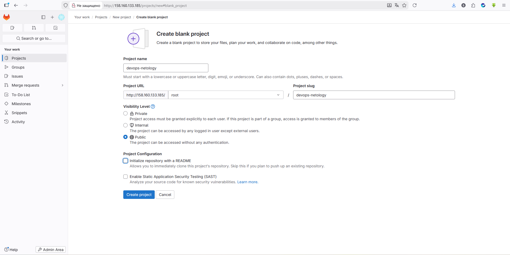


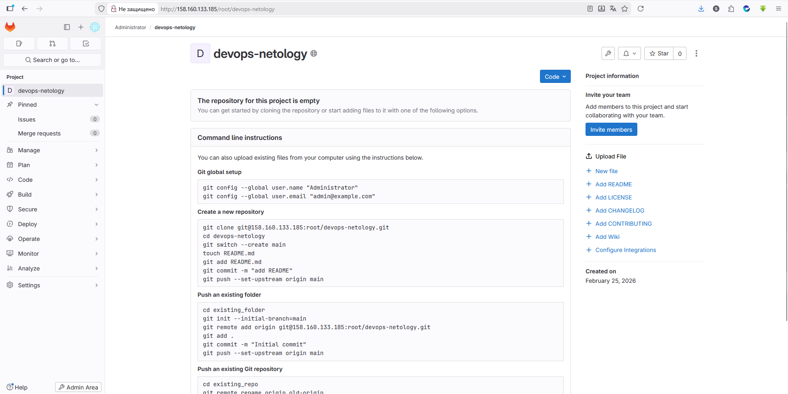

   - Галочку Initialize repository with a README лучше не ставить, чтобы не пришлось разрешать конфликты.  
   - Если вы зарегистрировались при помощи аккаунта в другой системе и не указали пароль, то увидите сообщение: `You won't be able to pull or push project code via HTTPS until you set a password on your account`. Тогда перейдите по ссылке из этого сообщения и задайте пароль. Если вы уже умеете пользоваться SSH-ключами, то воспользуйтесь этой возможностью (подробнее про SSH мы поговорим в следующем учебном блоке).  
   - Перейдите на страницу созданного вами репозитория, URL будет примерно такой: `https://gitlab.com/YOUR_LOGIN/devops-netology`. Изучите предлагаемые варианты для начала работы в репозитории в секции `Command line instructions`.  
   - Запомните вывод команды `git remote -v`.  


   - Из-за того, что это будет наш дополнительный репозиторий, ни один вариант из перечисленных в инструкции (на странице вновь созданного репозитория) нам не подходит. Поэтому добавляем этот репозиторий, как дополнительный remote, к созданному репозиторию в рамках предыдущего домашнего задания: `git remote add gitlab https://gitlab.com/YOUR_LOGIN/devops-netology.git`.  


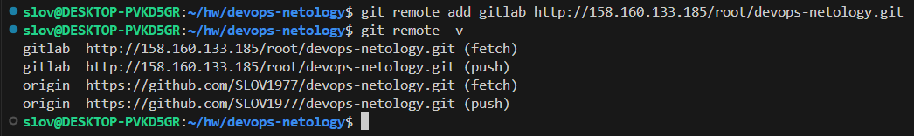

   - Отправьте изменения в новый удалённый репозиторий `git push -u gitlab main`.  


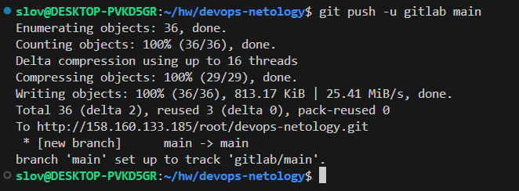

   - Обратите внимание, как изменился результат работы команды `git remote -v`.

Как изменить видимость репозитория в GitLab — сделать его публичным

   - На верхней панели выберите «Меню» -> «Проекты» и найдите свой проект.  
   - На левой боковой панели выберите «Настройки» -> «Основные».  
   - Разверните раздел «Видимость» -> «Функции проекта» -> «Разрешения».  
   - Измените видимость проекта на `Public`.  
   - Нажмите «Сохранить изменения».

#### Bitbucket* (задание со звёздочкой)

Это самостоятельное задание, его выполнение необязательно.

Теперь необходимо проделать всё то же самое с Bitbucket.

   - Обратите внимание, что репозиторий должен быть публичным — отключите галочку `private repository` при создании репозитория.  
   - На вопрос `Include a README?` отвечайте отказом.  
   - В отличии от GitHub и GitLab в Bitbucket репозиторий должен принадлежать проекту, поэтому во время создания репозитория надо создать и проект, который можно назвать, например, `netology`.  
   - Аналогично GitLab на странице вновь созданного проекта выберите `https`, чтобы получить ссылку, и добавьте этот репозиторий, как `git remote add bitbucket ....`  
   - Обратите внимание, как изменился результат работы команды `git remote -v`.

Если всё проделано правильно, то результат команды `git remote -v` должен быть следующий:

```
$ git remote -v
bitbucket https://andreyborue@bitbucket.org/andreyborue/devops-netology.git (fetch)
bitbucket https://andreyborue@bitbucket.org/andreyborue/devops-netology.git (push)
gitlab	  https://gitlab.com/andrey.borue/devops-netology.git (fetch)
gitlab	  https://gitlab.com/andrey.borue/devops-netology.git (push)
origin	  https://github.com/andrey-borue/devops-netology.git (fetch)
origin	  https://github.com/andrey-borue/devops-netology.git (push)
```
Дополнительно можете добавить удалённые репозитории по ssh, тогда результат будет примерно такой:

```
git remote -v
bitbucket	git@bitbucket.org:andreyborue/devops-netology.git (fetch)
bitbucket	git@bitbucket.org:andreyborue/devops-netology.git (push)
bitbucket-https	https://andreyborue@bitbucket.org/andreyborue/devops-netology.git (fetch)
bitbucket-https	https://andreyborue@bitbucket.org/andreyborue/devops-netology.git (push)
gitlab	git@gitlab.com:andrey.borue/devops-netology.git (fetch)
gitlab	git@gitlab.com:andrey.borue/devops-netology.git (push)
gitlab-https	https://gitlab.com/andrey.borue/devops-netology.git (fetch)
gitlab-https	https://gitlab.com/andrey.borue/devops-netology.git (push)
origin	git@github.com:andrey-borue/devops-netology.git (fetch)
origin	git@github.com:andrey-borue/devops-netology.git (push)
origin-https	https://github.com/andrey-borue/devops-netology.git (fetch)
origin-https	https://github.com/andrey-borue/devops-netology.git (push)
```

Выполните push локальной ветки main в новые репозитории.

Подсказка: `git push -u gitlab main`. На этом этапе история коммитов во всех трёх репозиториях должна совпадать.

### Задание 2. Теги

Представьте ситуацию, когда в коде была обнаружена ошибка — надо вернуться на предыдущую версию кода, исправить её и выложить исправленный код в продакшн. Мы никуда не будем выкладывать код, но пометим некоторые коммиты тегами и создадим от них ветки.

   - Создайте легковестный тег `v0.0` на HEAD-коммите и запуште его во все три добавленных на предыдущем этапе `upstream`.  


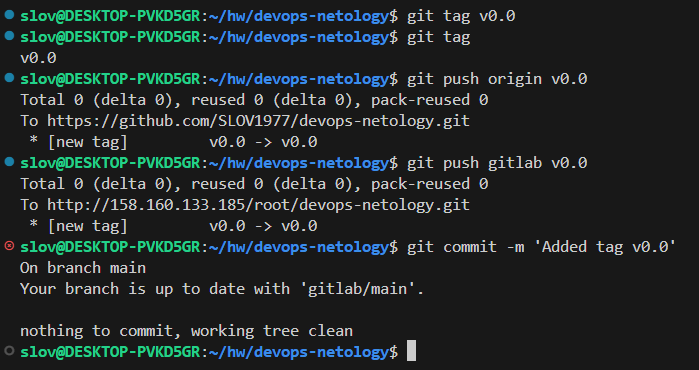

   - Аналогично создайте аннотированный тег `v0.1`.  


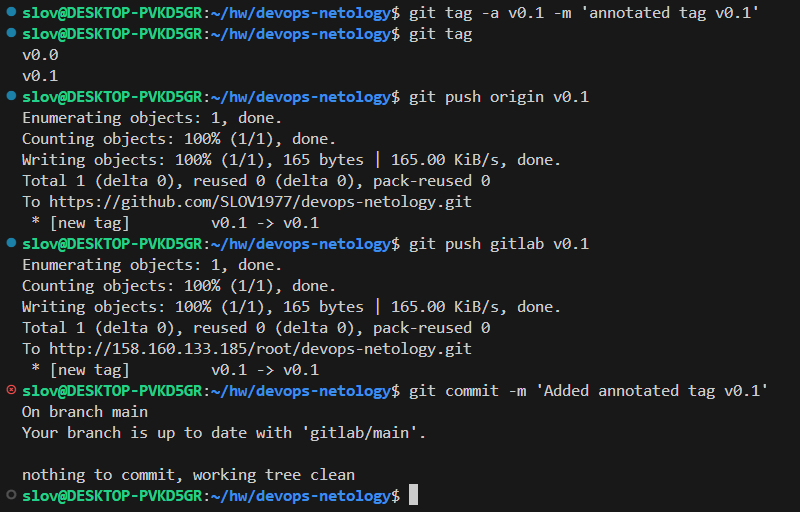

   - Перейдите на страницу просмотра тегов в GitHab (и в других репозиториях) и посмотрите, чем отличаются созданные теги.  
      - в GitHub — `https://github.com/YOUR_ACCOUNT/devops-netology/releases`;  


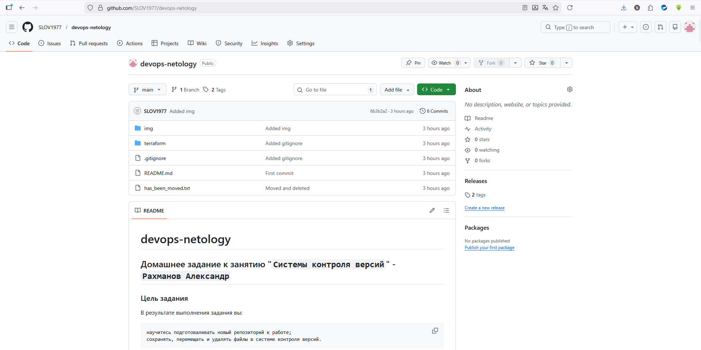


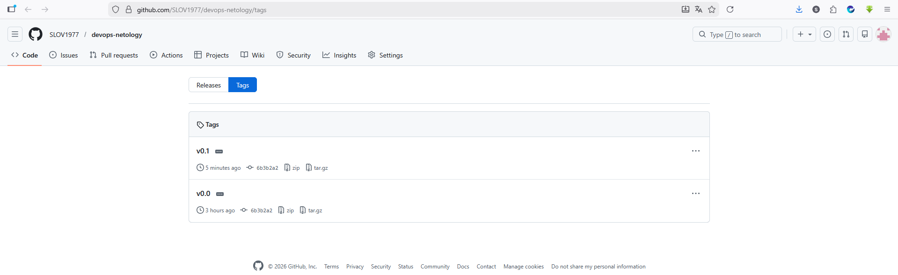

      - в GitLab — `https://gitlab.com/YOUR_ACCOUNT/devops-netology/-/tags`;  


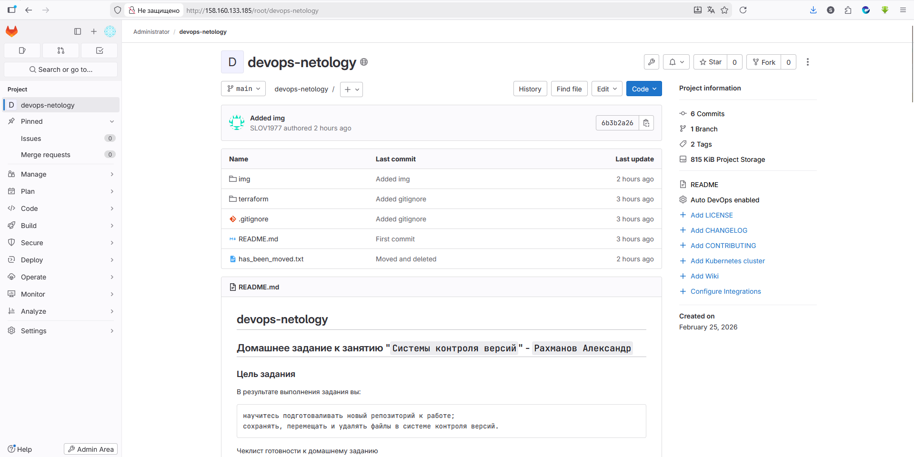


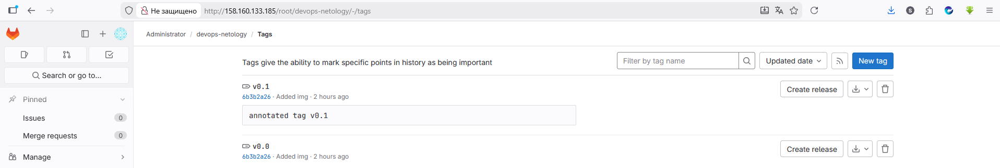

      - в Bitbucket — список тегов расположен в выпадающем меню веток на отдельной вкладке.

### Задание 3. Ветки

Давайте посмотрим, как будет выглядеть история коммитов при создании веток.

   - Переключитесь обратно на ветку `main`, которая должна быть связана с веткой `main` репозитория на github.  


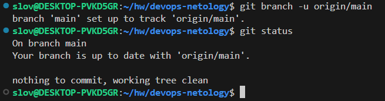

   - Посмотрите лог коммитов и найдите хеш коммита с названием `Prepare to delete and move`, который был создан в пределах предыдущего домашнего задания.  
   - Выполните `git checkout` по хешу найденного коммита.  


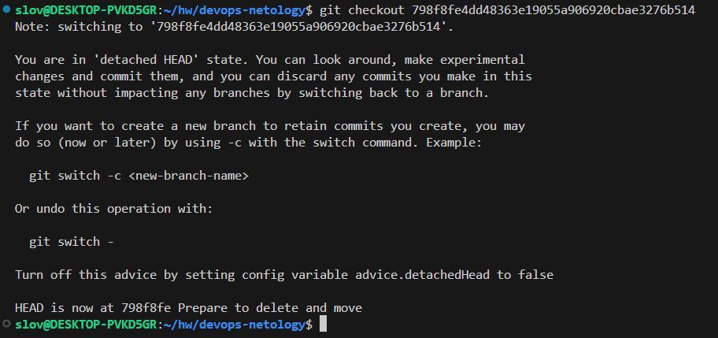

   - Создайте новую ветку `fix`, базируясь на этом коммите `git switch -c fix`.  


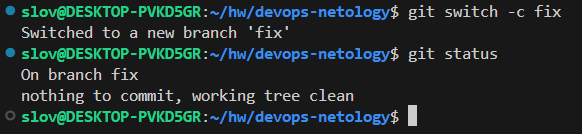

   - Отправьте новую ветку в репозиторий на GitHub `git push -u origin fix`.  


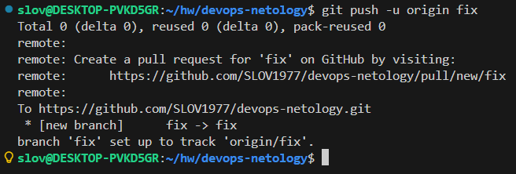

   - Посмотрите, как визуально выглядит ваша схема коммитов: `https://github.com/YOUR_ACCOUNT/devops-netology/network`.  


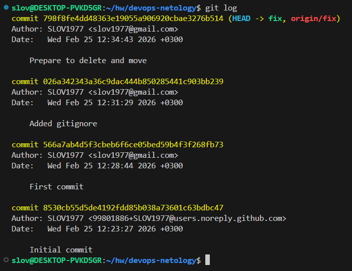

   - Теперь измените содержание файла `README.md`, добавив новую строчку.  


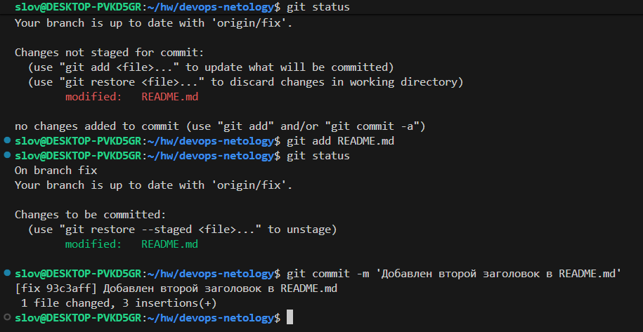

   - Отправьте изменения в репозиторий и посмотрите, как изменится схема на странице `https://github.com/YOUR_ACCOUNT/devops-netology/network` и как изменится вывод команды `git log`.


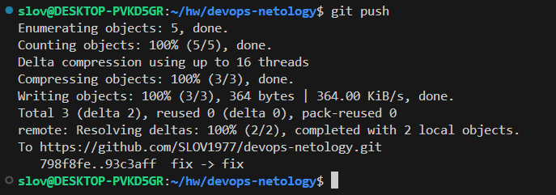


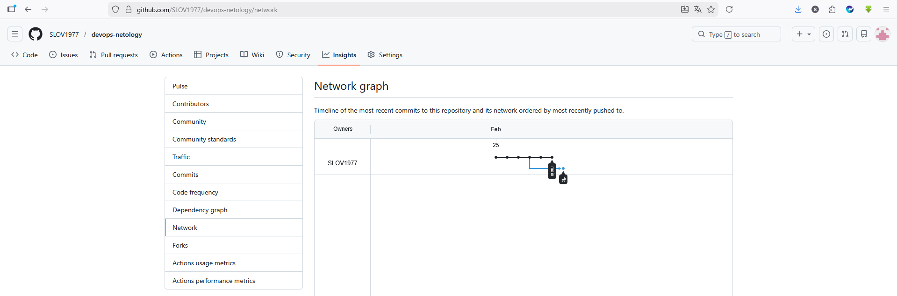


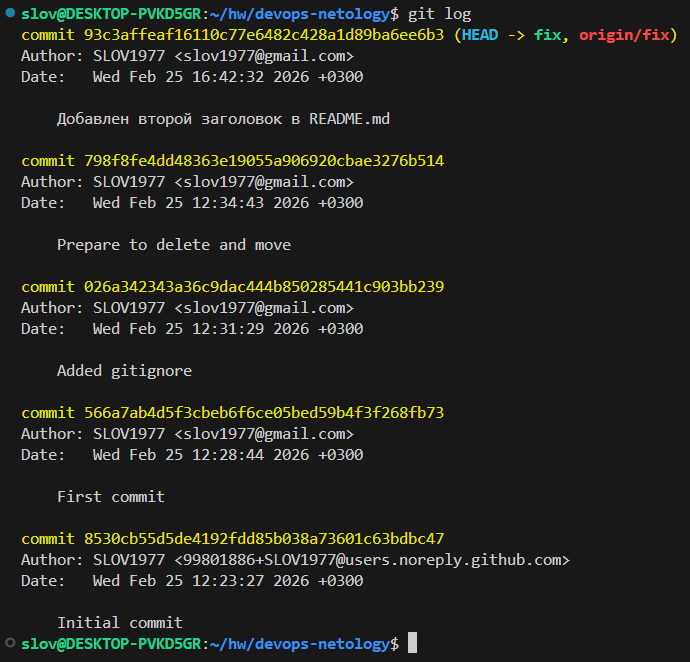

### Задание 4. Упрощаем себе жизнь

Попробуем поработь с Git при помощи визуального редактора.

   - В используемой `IDE PyCharm` откройте визуальный редактор работы с Git, находящийся в меню `View -> Tool Windows -> Git`.  
   - Измените какой-нибудь файл, и он сразу появится на вкладке `Local Changes`, отсюда можно выполнить коммит, нажав на кнопку внизу этого диалога.  
   - Элементы управления для работы с Git будут выглядеть примерно так:  


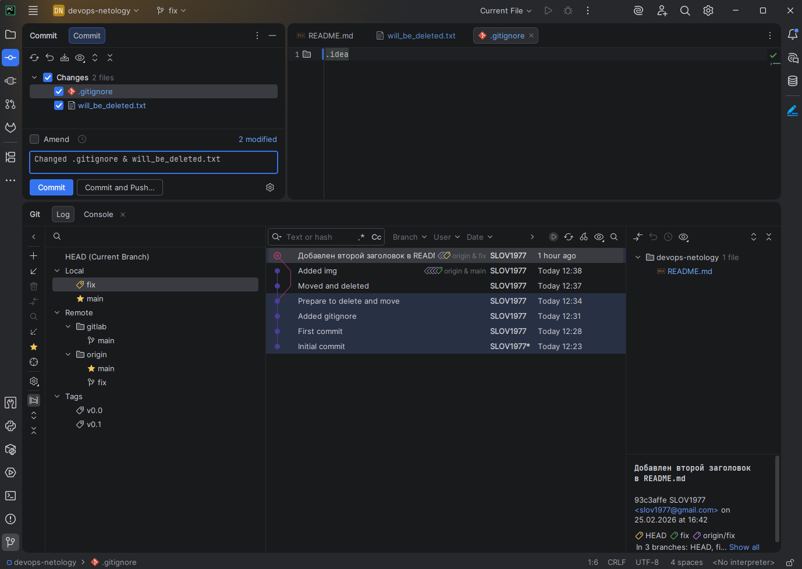


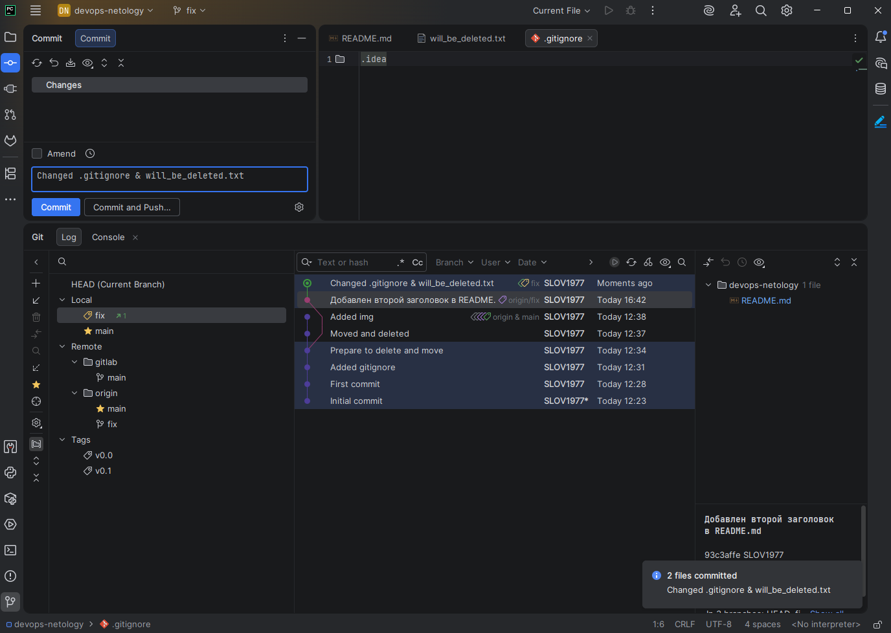

   - Работа с гитом  
   - Попробуйте выполнить пару коммитов, используя IDE.


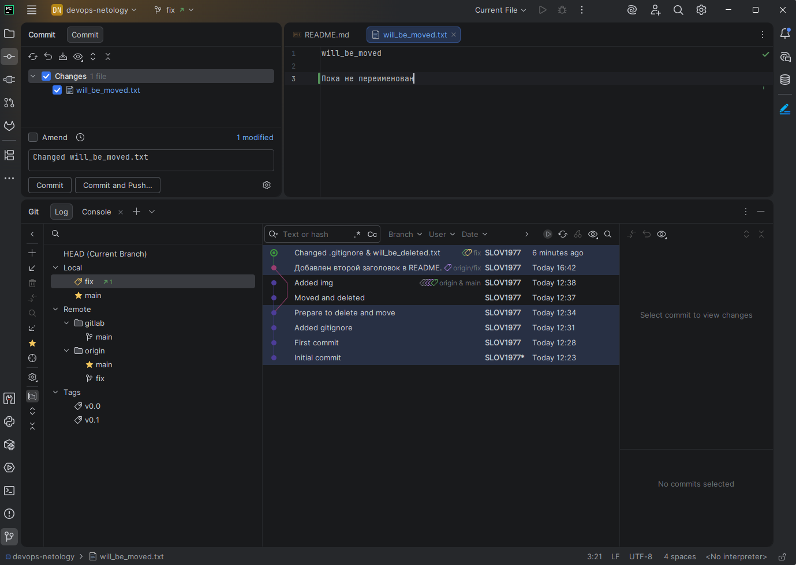


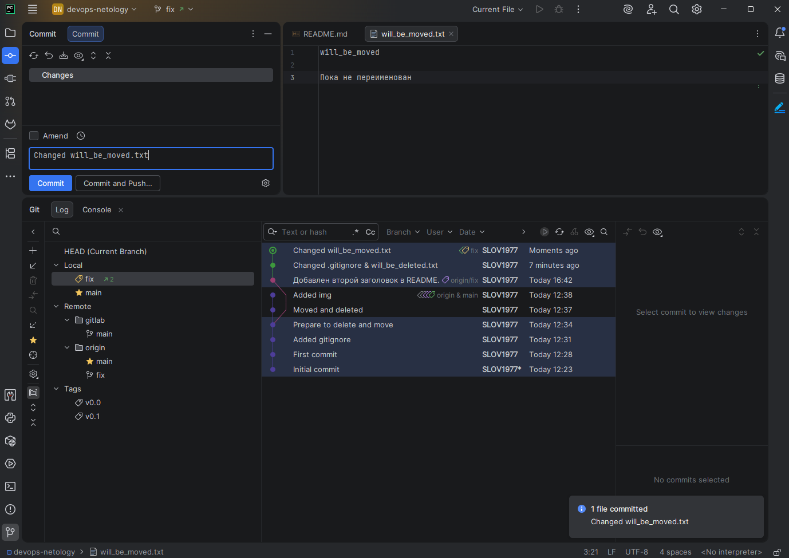

Если вверху экрана выбрать свою операционную систему, можно посмотреть горячие клавиши для работы с Git. Подробней о визуальном интерфейсе мы расскажем на одной из следующих лекций.

В качестве результата работы по всем заданиям приложите ссылки на ваши репозитории в GitHub, GitLab и Bitbucket.

### Правила приёма домашнего задания

В личном кабинете отправлены ссылки на ваши репозитории.

### Критерии оценки

#### Зачёт:

   - выполнены все задания;  
   - ответы даны в развёрнутой форме;  
   - приложены соответствующие скриншоты и файлы проекта;  
   - в выполненных заданиях нет противоречий и нарушения логики.

#### На доработку:

   - задание выполнено частично или не выполнено вообще;  
   - в логике выполнения заданий есть противоречия и существенные недостатки.

Обязательными являются задачи без звёздочки. Их выполнение необходимо для получения зачёта и диплома о профессиональной переподготовке.

Задачи со звёздочкой (*) являются дополнительными или задачами повышенной сложности. Они необязательные, но их выполнение поможет лучше разобраться в теме.