# devops-netology

## Домашнее задание к занятию "`Системы контроля версий`" - `Рахманов Александр`

### Цель задания

В результате выполнения задания вы:

    научитесь подготоваливать новый репозиторий к работе;  
    сохранять, перемещать и удалять файлы в системе контроля версий.

Чеклист готовности к домашнему заданию

    Установлена консольная утилита для работы с Git.

Инструкция к заданию

    Домашнее задание выполните в GitHub-репозитории.  
    В личном кабинете отправьте на проверку ссылку на ваш репозиторий с домашним заданием.  
    Любые вопросы по решению задач задавайте в разделе "Вопросы по заданию".

Дополнительные материалы для выполнения задания

    GitHub.  
    Инструкция по установке Git.  
    Книга про Git на русском языке - рекомендуем к обязательному изучению главы 1-7.  

#### Задание 1. Создать и настроить репозиторий для дальнейшей работы на курсе

В рамках курса вы будете писать скрипты и создавать конфигурации для различных систем, которые необходимо сохранять для будущего использования. Сначала надо создать и настроить локальный репозиторий, после чего добавить удалённый репозиторий на GitHub.
Создание репозитория и первого коммита

   - Зарегистрируйте аккаунт на `https://github.com/`. Если предпочитаете другое хранилище для репозитория, можно использовать его.  
   - Создайте публичный репозиторий, который будете использовать дальше на протяжении всего курса, желательное с названием `devops-netology`. Обязательно поставьте галочку `Initialize this repository with a README`.  

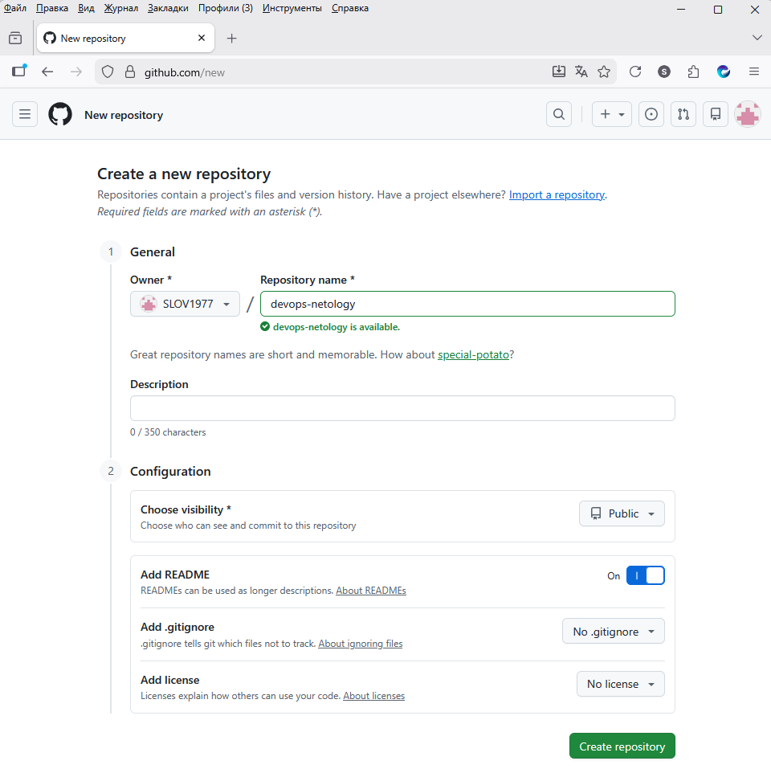

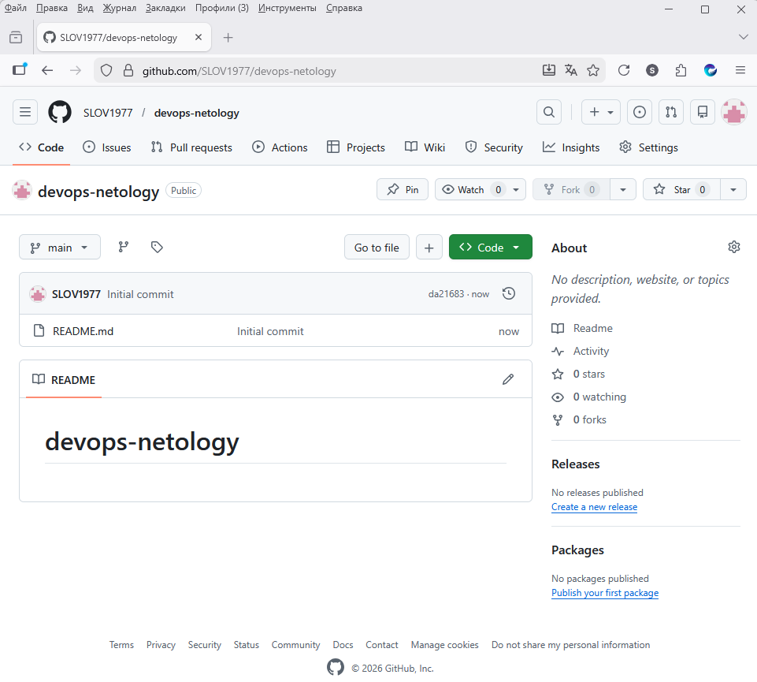

   - Создайте авторизационный токен для клонирования репозитория.  
   - Склонируйте репозиторий, используя протокол HTTPS `(git clone ...)`.  

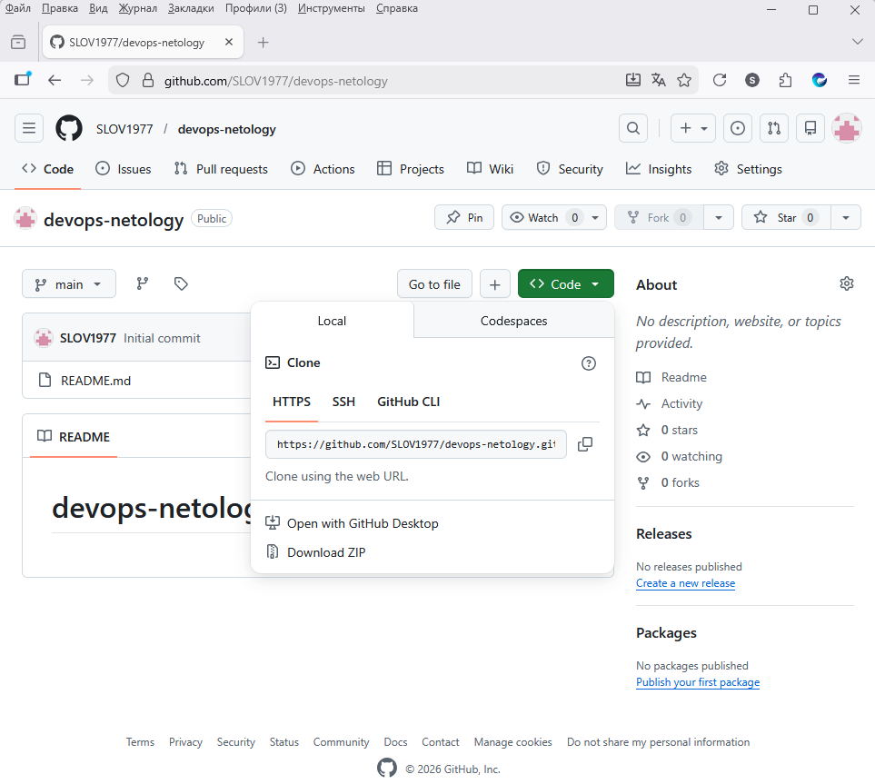

   - Перейдите в каталог с клоном репозитория `(cd devops-netology)`.  

   - Произведите первоначальную настройку Git, указав своё настоящее имя, чтобы нам было проще общаться, и email `(git config --global user.name и git config --global user.email johndoe@example.com)`.  
   - Выполните команду `git status` и запомните результат.  

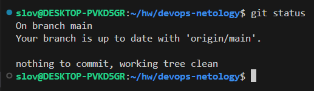

   - Отредактируйте файл `README.md` любым удобным способом, тем самым переведя файл в состояние `Modified`.  
   - Ещё раз выполните `git status` и продолжайте проверять вывод этой команды после каждого следующего шага.  
   - Теперь посмотрите изменения в файле `README.md`, выполнив команды `git diff` и `git diff --staged`.  

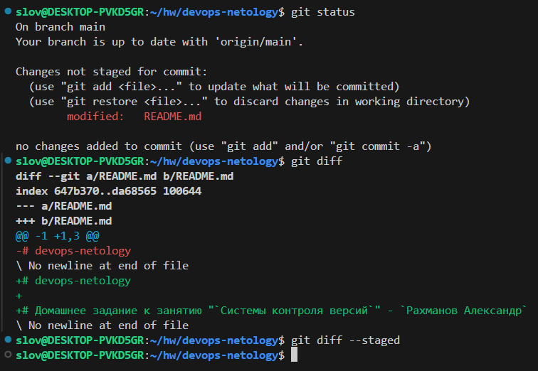

   - Переведите файл в состояние `staged` (или, как говорят, просто добавьте файл в коммит) командой `git add README.md`.  
   - И ещё раз выполните команды `git diff` и `git diff --staged`. Поиграйте с изменениями и этими командами, чтобы чётко понять, что и когда они отображают.  

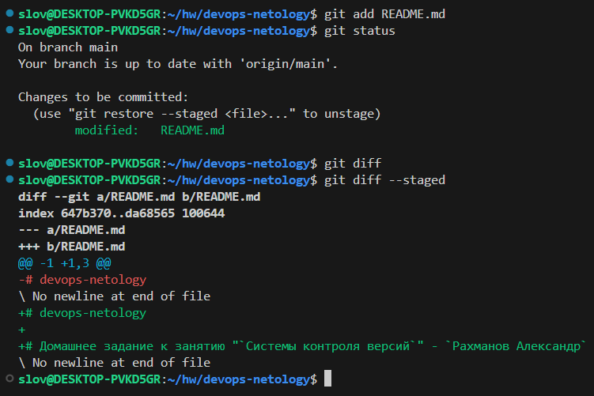

   - Теперь можно сделать коммит `git commit -m 'First commit'`.  
   - И ещё раз посмотреть выводы команд `git status`, `git diff` и `git diff --staged`.

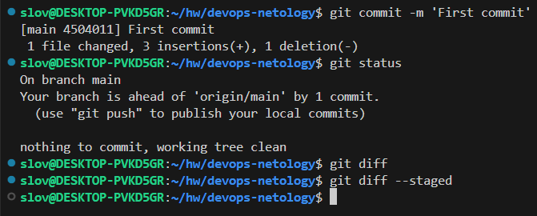

Создание файлов `.gitignore` и второго коммита

   - Создайте файл `.gitignore` (обратите внимание на точку в начале файла), проверьте его статус сразу после создания.  
   - Добавьте файл `.gitignore` в следующий коммит `(git add...)`.  
   - На одном из следующих блоков вы будете изучать Terraform, давайте сразу создадим соотвествующий каталог `terraform` и внутри этого каталога — файл `.gitignore` по примеру: `(https://github.com/github/gitignore/blob/master/Terraform.gitignore)`.  
   - В файле `README.md` опишите своими словами, какие файлы будут проигнорированы в будущем благодаря добавленному `.gitignore`.  

В файле terraform/.gitignore описаны файлы, версии которых мы не контролируем и не включаем в репозиторий:

   - .terraform - каталог, который Terraform использует для управления кешированными подключаемыми модулями и модулями провайдера, для записи того, какая рабочая область активна в данный момент, и для записи последней известной конфигурации серверной части на случай, если потребуется перенести состояние при следующем запуске.  
   - *.tfstate - файлы и каталоги с данными о состоянии.  
   - crash.log - журнал сбоев Terraform.  
   - *.tfvars - файлы объявления переменных, которые могут содержать конфиденциальные данные.  
   - override.tf - файлы переопределения конфигурации.  
   - .terraformrc - пользовательский файл конфигурации CLI

Это означает, что git будет игнорировать:  
   - все файлы находящиеся в каталоге .terraform  
   - файлы имеющие расширения - tfstate, tfvars  
   - файлы имена которых буду содержать crash.log, override.tf, .terraformrc.  
Т.е. все вышеперечисленные файлы останутся только в локальном репозитории.

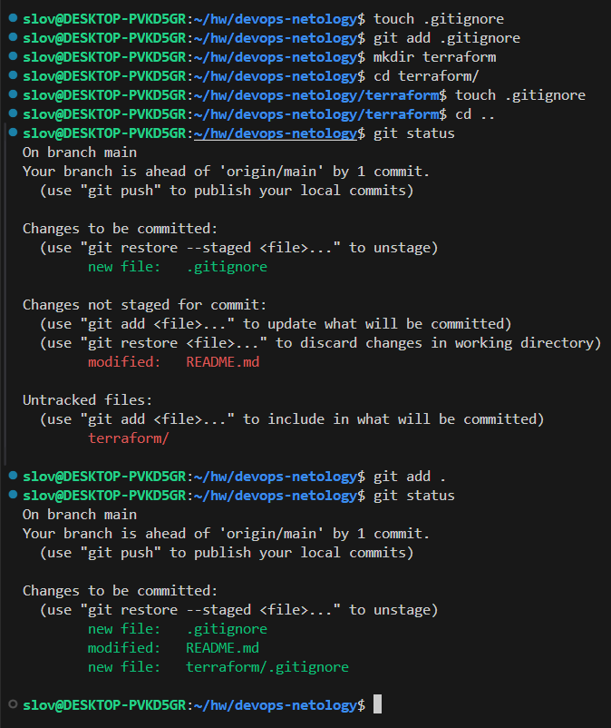

   - Закоммитьте все новые и изменённые файлы. Комментарий к коммиту должен быть `Added gitignore`.

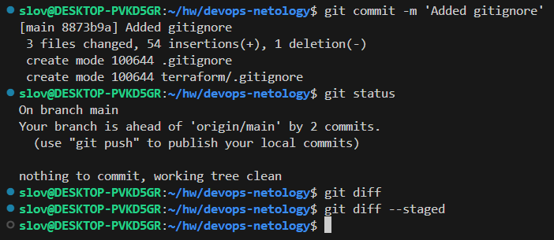

Эксперимент с удалением и перемещением файлов (третий и четвёртый коммит)

   - Создайте файлы `will_be_deleted.txt` (с текстом `will_be_deleted`) и `will_be_moved.txt` (с текстом `will_be_moved`) и закоммите их с комментарием `Prepare to delete and move`.  

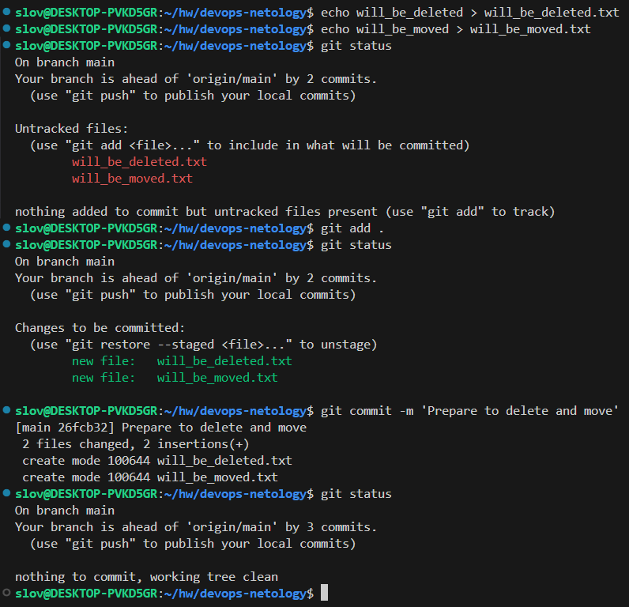

   - В случае необходимости обратитесь к официальной документации — здесь подробно описано, как выполнить следующие шаги.  
   - Удалите файл `will_be_deleted.txt` с диска и из репозитория.  

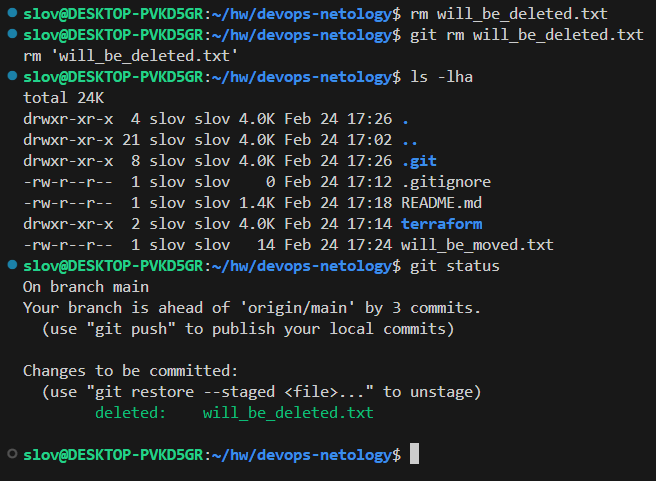

   - Переименуйте (переместите) файл `will_be_moved.txt` на диске и в репозитории, чтобы он стал называться `has_been_moved.txt`.  

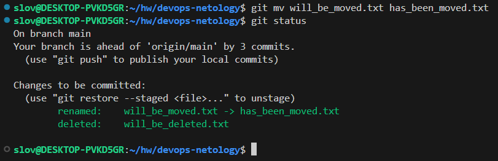

   - Закоммитьте результат работы с комментарием `Moved and deleted`.

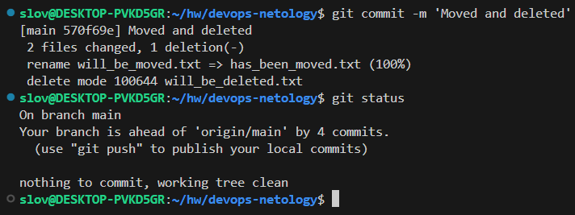

#### Проверка изменения

    В результате предыдущих шагов в репозитории должно быть как минимум пять коммитов (если вы сделали ещё промежуточные — нет проблем):
       - `Initial Commit` — созданный GitHub при инициализации репозитория.  
       - `First commit` — созданный после изменения файла `README.md`.  
       - `Added gitignore` — после добавления `.gitignore`.  
       - `Prepare to delete and move` — после добавления двух временных файлов.  
       - `Moved and deleted` — после удаления и перемещения временных файлов.  
    Проверьте это, используя комманду `git log`. Подробно о формате вывода этой команды мы поговорим на следующем занятии, но посмотреть, что она отображает, можно уже сейчас.

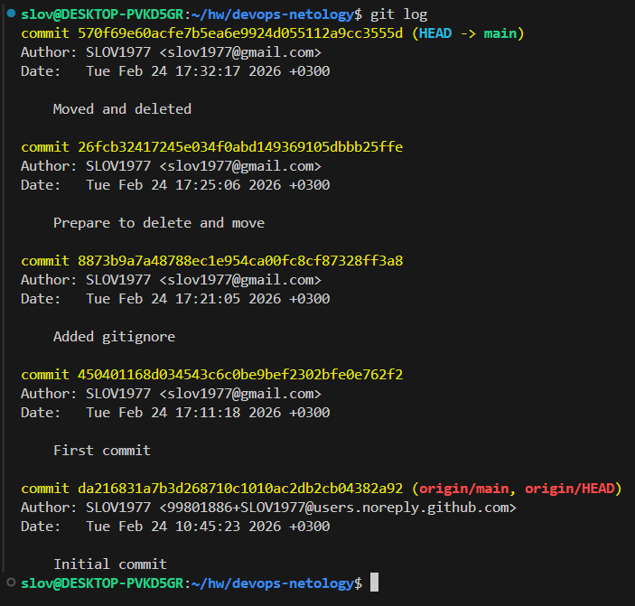

#### Отправка изменений в репозиторий

Выполните команду `git push`, если Git запросит логин и пароль — введите ваши логин и пароль от GitHub.

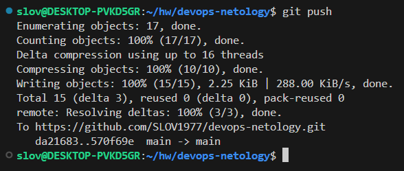

В качестве результата отправьте ссылку на репозиторий.

#### Правила приёма домашнего задания

В личном кабинете отправлена ссылка на ваш репозиторий.
Критерии оценки

#### Зачёт:

   - выполнены все задания;  
   - ответы даны в развёрнутой форме;  
   - приложены соответствующие скриншоты и файлы проекта;  
   - в выполненных заданиях нет противоречий и нарушения логики.  

#### На доработку:

   - задание выполнено частично или не выполнено вообще;  
   - в логике выполнения заданий есть противоречия и существенные недостатки.

## Домашнее задание к занятию "`Основы Git`" - `Рахманов Александр`